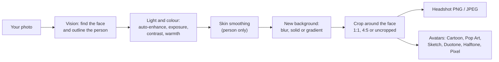

# Headshot Generator

A native macOS app, plus a website version, that turns an everyday photo into a clean, professional-looking headshot and a set of stylized avatars. Everything runs on your Mac with Apple's Vision and Core Image frameworks: no cloud, no API keys, and your photos never leave the machine.

**[Instructions →](docs/INSTRUCTIONS.md)** · [System design](docs/SYSTEM-DESIGN.md) · [File structure](docs/FILE-STRUCTURE.md) · [Try it in your browser](https://amalmehta.github.io/headshot_generator/)
