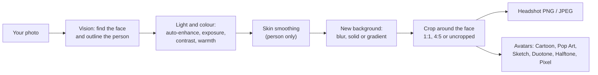

# Headshot Generator

**Try it in your browser:** https://amalmehta.github.io/headshot_generator/

A native macOS app, plus a website version, that turns an everyday photo into a clean, professional-looking headshot and a set of stylized avatars. Everything runs on your Mac with Apple's Vision and Core Image frameworks: no cloud, no API keys, and your photos never leave the machine.



## Features

**Headshot**
- Finds the face and crops head-and-shoulders automatically (square 1:1, portrait 4:5, or uncropped)
- Outlines the person and replaces the background: keep it, blur it, use a solid colour or a studio gradient
- Auto-enhance, plus sliders for exposure, contrast, saturation and warmth
- Edge-preserving skin smoothing that only touches the person
- Before/after toggle; export as PNG or JPEG at full resolution

**Avatars**
- Six styles made from your headshot: Cartoon, Pop Art, Pencil Sketch, Duotone, Halftone, Pixel
- Export each one, with an optional circular profile-picture crop (transparent corners)

**Feedback**
- A small "Feedback" tab in the window's bottom-right corner. Feedback is saved locally to `~/Library/Application Support/HeadshotGenerator/feedback.jsonl`.

## Requirements

- macOS 14 (Sonoma) or later
- Xcode 15 or later (for the Swift toolchain)

## Build

```bash
./scripts/build_app.sh
```

This builds a release binary and packages it as `build/Headshot Generator.app`, signed ad hoc. Open it with:

```bash
open "build/Headshot Generator.app"
```

For development you can also run it straight from the package:

```bash
swift run HeadshotGenerator
```

## Usage

1. Drag a photo into the window, or click **Open…** (⌘O).
2. On the **Headshot** tab, choose a crop and background, and adjust light, colour and smoothing. The side panel shows whether a face and a person outline were found.
3. Click **Export Headshot…** (⌘E).
4. Switch to the **Avatars** tab and click **Export…** under any style.

If no face is found, the app crops from the centre. If the person can't be outlined, the background is left as it is.

## Tests

```bash
swift test
```

The test that runs on a real face is skipped unless you point it at a portrait. It can also write its outputs to a folder:

```bash
HEADSHOT_TEST_IMAGE=/path/to/portrait.jpg HEADSHOT_TEST_OUTPUT=/tmp/out swift test
```

## Website

The site in `web/` does the same job in the browser: MediaPipe (WebAssembly) finds the face and outlines the person, and plain JavaScript does the pixel work. Your photo never leaves the browser. The first photo downloads about 12 MB of library and model files from jsDelivr and Google, and the browser caches them after that.

It's plain HTML and JavaScript with no build step. To run it locally:

```bash
cd web
npm run serve        # http://localhost:8080
```

To run its tests (Node 20 or later):

```bash
cd web
npm test
```

Every push to `main` that touches `web/` runs those tests and deploys the site to GitHub Pages (`.github/workflows/pages.yml`).

## Project layout

```
Sources/HeadshotCore/        image pipeline: analysis, rendering, framing, avatar styles
Sources/HeadshotGenerator/   SwiftUI app and feedback tab
Tests/HeadshotCoreTests/     unit tests
scripts/build_app.sh         builds the .app bundle
scripts/make_icon.sh         regenerates the Mac and website icons from Resources/AppIcon.svg (needs rsvg-convert)
Resources/                   app icon: AppIcon.svg (source) and AppIcon.icns (built)
web/                         website: index.html, styles.css, icons, js/ (framing, imageops, avatars, vision, app), tests/
```
