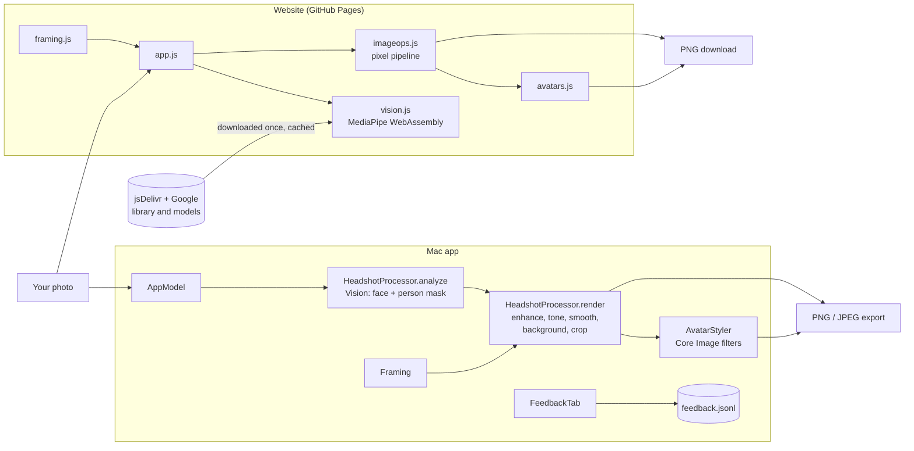
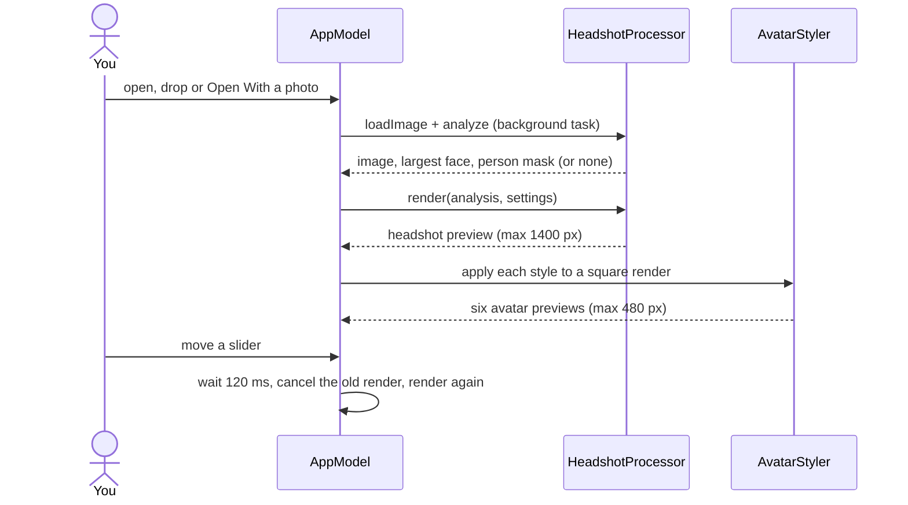

# System design

How Headshot Generator is put together. Back to the [README](../README.md) · [Instructions](INSTRUCTIONS.md) · [File structure](FILE-STRUCTURE.md)

## Overview

Headshot Generator turns one photo into a cropped, retouched headshot and six stylized avatars. The Mac app uses
Apple's Vision and Core Image; the website does the same job in the browser with MediaPipe and plain JavaScript.
Both run entirely on your device: there's no server and the photo is never uploaded.

## Components

| Part | What it does | Where |
|---|---|---|
| **HeadshotProcessor** | Loads the photo (orientation applied), runs face detection and person segmentation once, then renders: auto-enhance, exposure, contrast/saturation, warmth, edge-preserving smoothing on the person, new background, crop. Writes PNG or JPEG. | `Sources/HeadshotCore/HeadshotProcessor.swift` |
| **HeadshotSettings** | Every user choice in one value type: background style and colour, crop aspect, sliders. | `Sources/HeadshotCore/HeadshotSettings.swift` |
| **Framing** | Pure geometry: sizes the crop so the face fills 40% of its height and sits a little above centre; centre-crops when there's no face. | `Sources/HeadshotCore/Framing.swift` |
| **AvatarStyler** | Normalizes the headshot to 1024 px square and applies one of six Core Image looks; optional circular crop with transparent corners. | `Sources/HeadshotCore/AvatarStyler.swift` |
| **AppModel** | Holds the analysis, debounces re-renders, renders preview-sized headshot and avatars off the main thread, handles open and save panels. | `Sources/HeadshotGenerator/AppModel.swift` |
| **Mac app** | SwiftUI window, Dock-icon and "Open With" handling, feedback tab. | `Sources/HeadshotGenerator/` |
| **Website** | `vision.js` (MediaPipe face detector and selfie segmenter), `imageops.js` (pixel work on typed arrays), `framing.js` and `avatars.js` (ports of the Swift versions), `app.js` (UI and export). | `web/js/` |
| **Deploy** | On push to `main` touching `web/`, runs the web tests, then publishes the site to GitHub Pages. | `.github/workflows/pages.yml` |

## Main flows

**Open a photo and edit it (Mac)**

**Export.** Export re-renders from the stored analysis at full resolution (not the preview), then writes PNG or
JPEG depending on the file extension you pick. Avatar exports always use a square crop and, if chosen, the
circular mask.

**Website.** The photo is drawn to a canvas (longest side capped at 4096 px), analysed once by MediaPipe, then
cropped first and processed second, so previews only touch the pixels that are shown. Exports download as PNG.

## Data and storage

| Data | Where | Notes |
|---|---|---|
| Photo and analysis | In memory | Analysed once per photo; changing settings reuses it. Nothing is written until you export. |
| Settings | In memory | Reset on each launch or page load; not persisted. |
| Exports | Where you save them (Mac) / browser downloads (web) | Full resolution on the Mac; up to 4096 px on the web. |
| Feedback (Mac) | `~/Library/Application Support/HeadshotGenerator/feedback.jsonl` | Local only. The website's feedback panel links to a GitHub issue instead. |
| Web models | jsDelivr and Google model storage | About 12 MB on first use, then cached by the browser; warmed up when the page is idle. |

## Design decisions

- **On-device only.** Vision and Core Image on the Mac, MediaPipe WebAssembly in the browser: private and free to
  run, at the cost of quality limited to what those built-in models can do.
- **Analyse once, render many.** Face detection and segmentation are the slow part, so they're cached in
  `PhotoAnalysis` and every slider change only re-runs the filter pipeline.
- **Ignore near-empty person masks.** Both segmenters return a mask even with nobody in the photo; below 5%
  coverage it's dropped, so the background is left alone rather than replacing the whole picture.
- **Two implementations of one pipeline.** The website mirrors the Swift code (same defaults, framing numbers and
  styles) rather than sharing it. It's simple and needs no build step, but the two must be kept in step by hand,
  and the results look similar rather than identical.
- **Debounced, cancellable rendering.** A 120 ms wait and task cancellation keep sliders responsive.
- **Smoothing only on the person.** The skin-smoothing blend is masked so the background stays sharp.

## Testing

`swift test` covers framing (square and 4:5 crops, faces near edges, oversized faces, no face), rendering every
background without a face, warmth, avatar sizes and the circular mask, and the "no person, no mask" rule. A test
on a real portrait runs only when `HEADSHOT_TEST_IMAGE` is set. `npm test` in `web/` covers the same ground for
the JavaScript pipeline (framing, blur, warmth, backgrounds, avatar styles, mask resampling). The SwiftUI views and
the browser UI aren't tested.

## Limits

- One photo at a time, and only the largest face is used for framing.
- Without a face it crops from the centre; without a person outline the background can't be changed.
- The website needs a network connection the first time to fetch the models, and caps photos at 4096 px.
- Settings aren't remembered between sessions.
